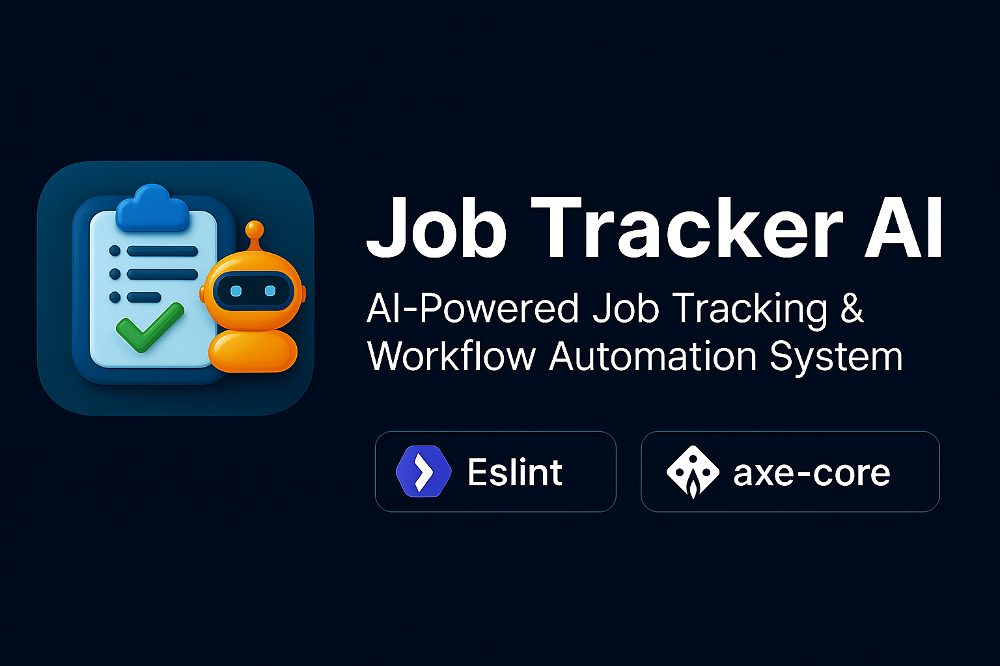
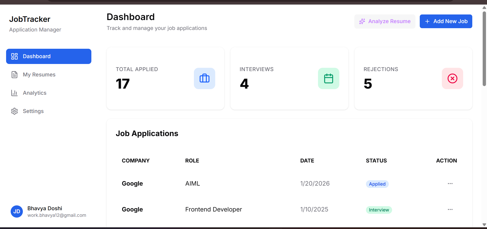
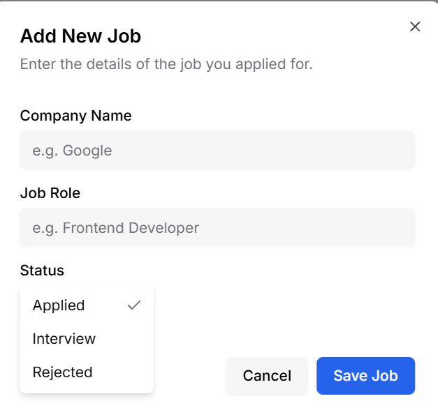
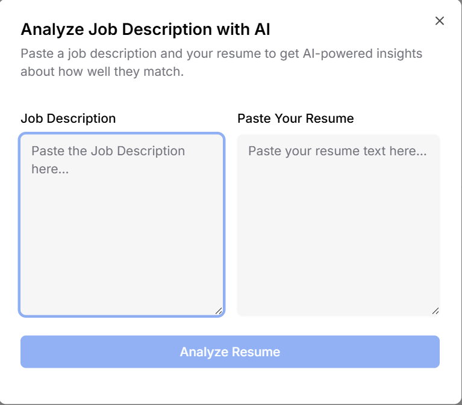

# 🚀 JOB TRACKER AI

<p align="center">
  
</p>

<p align="center">
  <b>An AI-powered Job Tracking & Workflow Automation System built with Node.js</b>
</p>

<p align="center">
  
  
  
  
  
</p>

---

## 📖 Overview

**JOB TRACKER AI** is a modern **Node.js-based application** designed to help users **track job applications**, **manage hiring workflows**, and **analyze job-related data** efficiently.

The project focuses on **clean architecture**, **automation**, **configuration safety**, **accessibility testing**, and **scalable data storage**, making it ideal for real-world use and professional portfolios.

---

## ✨ Features

### 📌 Core Functionality
- Track job applications, companies, and statuses
- Manage notes, updates, and workflow stages
- AI-assisted workflow suggestions *(optional integration)*
- Lightweight & scalable data handling

### 🔐 Configuration & Storage
- Secure environment variables with **Dotenv**
- Flexible configuration using **JSON5**
- Key-value storage via **Keyv** (SQLite, Redis, etc.)

### 🛡 Code Quality & Tooling
- **ESLint** for consistent code standards
- **eslint-plugin-import** for import/export validation
- **Espree** for modern JavaScript parsing
- Modular & maintainable project structure

### ♿ Utilities & Performance
- Accessibility testing using **Axe-core**
- Fast file scanning with **Fast-glob**
- Smart pattern matching using **Micromatch**

---

## 📸 Application Preview

### 📊 Dashboard
<p align="center">
  
</p>

### 💼 New Job Entry
<p align="center">
  
</p>

### 📈 Job Analysis
<p align="center">
  
</p>

---

## 🛠 Tech Stack

| Category | Technology |
|--------|------------|
| Runtime | Node.js 18+ |
| Language | JavaScript (ES2022) |
| Linting | ESLint |
| Storage | Keyv |
| Config | Dotenv, JSON5 |
| Utilities | Fast-glob, Micromatch |
| Accessibility | Axe-core |

---

## 🚀 Getting Started

### ✅ Prerequisites
- Node.js v18 or higher
- npm (bundled with Node.js)

---

## 📥 Installation

### 1️⃣ Clone Repository
```bash
git clone https://github.com/your-username/jobtracker-ai.git
cd jobtracker-ai
````

### 2️⃣ Install Dependencies

```bash
npm install
```

---

## ⚙️ Configuration

### Create `.env` file

```bash
touch .env
```

### Example `.env`

```ini
PORT=3000
DB_URI=sqlite://database.sqlite
OPENAI_API_KEY=your_api_key_here
```

### Optional JSON5 Config

```json5
{
  // App configuration
  maxItems: 50,
  enableAI: true,
}
```

---

## ▶️ Usage

### Development Mode

```bash
npm run dev
```

### Production Mode

```bash
npm start
```

### Lint the Code

```bash
npm run lint
```

---

## 🧪 Testing & Quality

* Code quality enforcement via ESLint
* Import/export consistency checks
* Automated accessibility testing

---

## 📁 Project Structure

```
JOB-TRACKER-AI/
│── src/
│── config/
│── utils/
│── tests/
│── Output_Images/
│── .env
│── package.json
│── README.md
```

---

## 🤝 Contributing

Contributions are welcome!

1. Fork the repository
2. Create a feature branch

   ```bash
   git checkout -b feature-name
   ```
3. Commit changes
4. Open a Pull Request

---

## 📄 License

This project is licensed under the **MIT License**.

---

## 👨‍💻 Author

**Bhavya Ketan Doshi**

<p align="center">
  ⭐ If you like this project, consider giving it a star!
</p>
```
